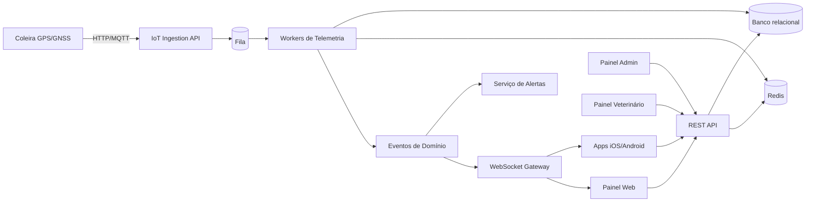

# Arquitetura completa do sistema

## Visão de produto

AnimalCheck será uma plataforma SaaS multi-tenant para rastreamento, saúde e atividade de animais. O produto deverá atender tutores individuais no início e evoluir para famílias, veterinários, empresas, fazendas, clínicas e hotéis para pets sem reescrita estrutural.

## Princípios arquiteturais

- Clean Architecture para separar domínio, aplicação, infraestrutura e apresentação.
- DDD para modelar agregados como usuário, animal, dispositivo, localização, geofence, alertas, assinatura e prontuário veterinário.
- SOLID para manter módulos coesos e extensíveis.
- Repository Pattern para isolar persistência.
- Service Pattern para orquestrar casos de uso.
- Events, Observers, Queues e Workers para processamento assíncrono.
- Cache distribuído com Redis para dados quentes, sessões, rate limit e presença.
- API versionada para compatibilidade com apps e firmware antigo.

## Componentes principais

## Módulos do domínio

1. **Identity & Access**: usuários, organizações, papéis, permissões, JWT, refresh token e auditoria.
2. **Subscription & Billing**: planos Free, Premium, Família, Veterinário e Empresas.
3. **Pet Profile**: cadastro completo do animal, doenças, medicamentos, chip, veterinário e documentos.
4. **Device Management**: coleiras, vínculo com animal, status, bateria, firmware, comandos e OTA.
5. **Telemetry**: ingestão, validação, normalização e armazenamento de pontos GPS.
6. **Realtime Tracking**: publicação de localização em canais WebSocket autorizados.
7. **Geofencing**: áreas circulares, retangulares e poligonais, detecção de entrada e saída.
8. **Alerts & Notifications**: push, e-mail, SMS futuro e WhatsApp futuro.
9. **Lost Mode**: modo de alta frequência, precisão máxima e notificações recorrentes.
10. **Health & Vet**: vacinas, consultas, medicamentos, peso, atividade e relatórios veterinários.
11. **Reports & Analytics**: gráficos diários, semanais, mensais e anuais.
12. **Admin & Operations**: gestão de usuários, dispositivos, logs, bloqueios e comandos OTA.

## Decisão de stack

- **Backend**: Laravel 12 com PHP 8.4 pela produtividade, ecossistema robusto, filas, broadcasting, policies e integração com OpenAPI.
- **Banco**: PostgreSQL recomendado para geodados com PostGIS; MySQL pode ser suportado, mas PostGIS reduz complexidade de geofence e consultas espaciais.
- **Redis**: cache, filas rápidas, rate limit, locks distribuídos e últimos estados de dispositivos.
- **Mobile**: Flutter recomendado para entregar Android e iOS com base única, performance nativa e UX consistente.
- **Web**: React, TypeScript e Tailwind para painel moderno, componentização e velocidade de desenvolvimento.
- **MQTT**: broker dedicado, como EMQX, HiveMQ ou Mosquitto inicialmente, com ponte para filas internas.

## Comunicação em tempo real

- O dispositivo envia telemetria por HTTP ou MQTT.
- A API valida assinatura, device token, payload e limites.
- Um evento `TelemetryReceived` é colocado na fila.
- Workers persistem histórico, atualizam último estado em Redis, avaliam geofences e alertas.
- O WebSocket publica `animal.location.updated` nos canais dos usuários autorizados.

## Estratégia multi-tenant

- Entidade `organizations` representa família, clínica, fazenda, hotel, empresa ou conta individual.
- Usuários pertencem a organizações com papéis.
- Animais, dispositivos, veterinários e assinaturas pertencem a uma organização.
- Compartilhamentos são modelados por permissões explícitas por animal.

## Limites por plano

| Plano | Animais | Familiares | Histórico | Geofences | Veterinário | Tempo real |
|---|---:|---:|---|---:|---|---|
| Free | 1 | 0 | 7 dias | 1 | Não | Básico |
| Premium | 3 | 2 | 12 meses | 5 | Sim | Padrão |
| Família | 10 | 8 | 24 meses | 20 | Sim | Padrão |
| Veterinário | 500 | Equipe | 36 meses | Por cliente | Painel completo | Padrão |
| Empresas | Custom | Custom | Custom | Custom | Custom | SLA |

## APIs planejadas

- REST v1 para apps, web e admin.
- WebSocket para tracking e alertas em tempo real.
- MQTT para ingestão IoT eficiente.
- HTTP ingest para dispositivos simples ou fallback.
- OpenAPI/Swagger gerado e versionado.

## Observabilidade

- Logs estruturados JSON.
- Métricas de ingestão, latência, fila, WebSocket, notificações, erros de dispositivo e uso por plano.
- Tracing distribuído para investigar telemetria até notificação.
- Auditoria para acessos, alterações sensíveis, comandos OTA e operações administrativas.
