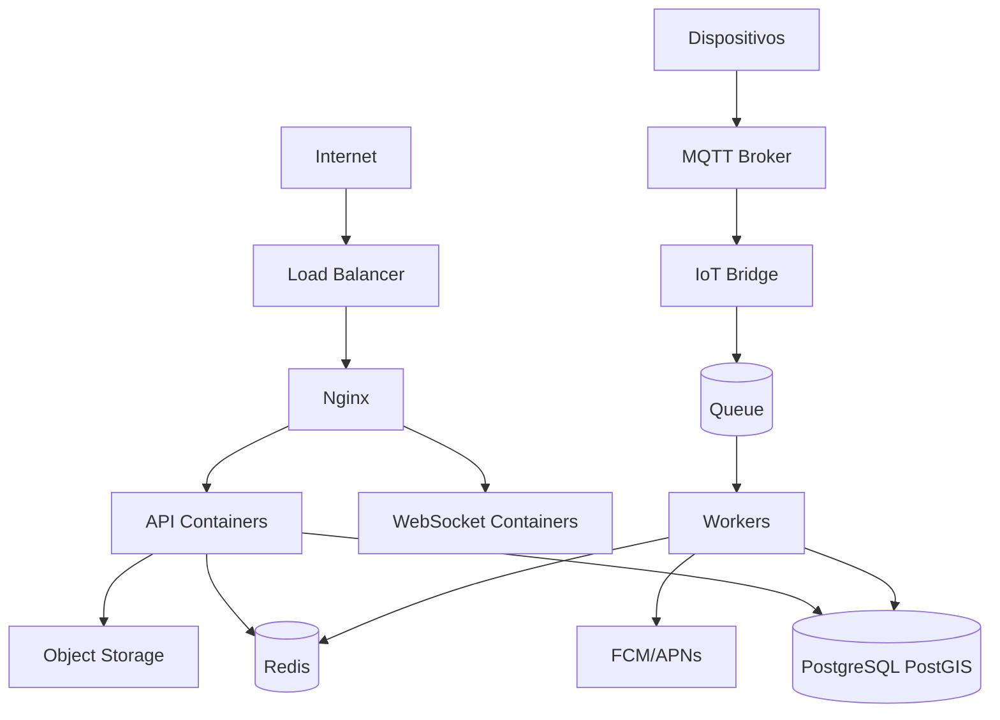

# Plano de infraestrutura em nuvem

## Ambientes

- `local`: Docker Compose para desenvolvimento.
- `staging`: ambiente próximo de produção para QA, testes de firmware e homologação.
- `production`: alta disponibilidade, backups, monitoramento e CI/CD controlado.

## Componentes

- Load balancer público.
- Nginx como reverse proxy.
- Containers para API Laravel, workers, scheduler e WebSocket.
- PostgreSQL gerenciado com PostGIS.
- Redis gerenciado.
- Broker MQTT gerenciado ou cluster próprio.
- Object storage para fotos, relatórios e exports.
- CDN para assets públicos e imagens.
- Serviço de push notification: FCM e APNs.
- Serviço de e-mail transacional.
- Observabilidade: logs, métricas, tracing e alertas.

## Topologia inicial

## CI/CD

- Pull request executa lint, testes unitários, testes de integração e análise estática.
- Build de imagens Docker versionadas por commit.
- Deploy automatizado em staging.
- Deploy em produção com aprovação manual no início.
- Migrações executadas com estratégia segura e rollback planejado.

## Backup e recuperação

- Backups automáticos diários do banco.
- Point-in-time recovery em produção.
- Backups de object storage com versionamento.
- Runbook para restauração.
- Testes periódicos de restore.
