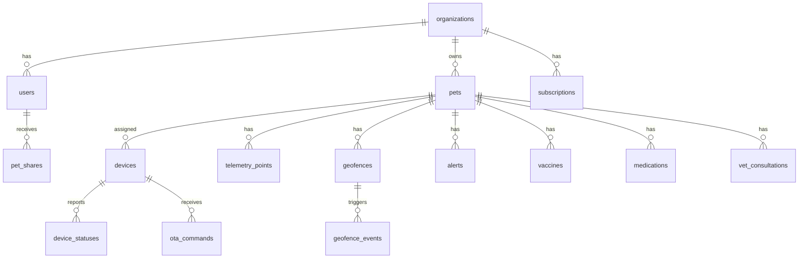

# Modelagem do banco de dados

## Banco recomendado

PostgreSQL com PostGIS é a escolha principal por oferecer índices espaciais, consultas geográficas e suporte maduro a polígonos, círculos aproximados e distância. MySQL pode ser usado no MVP, mas exigirá mais lógica na aplicação para geofencing avançado.

## Entidades principais

## Tabelas

### organizations

- `id` UUID PK
- `name`
- `type`: individual, family, veterinary_clinic, farm, pet_hotel, company
- `document_number` nullable
- `timezone`
- `created_at`, `updated_at`

### users

- `id` UUID PK
- `organization_id` FK
- `name`
- `email` unique
- `phone`
- `password_hash`
- `status`: active, invited, blocked, deleted
- `last_login_at`
- `created_at`, `updated_at`

### roles e permissions

- `roles`: `id`, `organization_id`, `name`, `scope`
- `permissions`: `id`, `key`, `description`
- `role_permission`: `role_id`, `permission_id`
- `user_role`: `user_id`, `role_id`

### pets

- `id` UUID PK
- `organization_id` FK
- `name`
- `photo_url`
- `species`: dog, cat, horse, large_animal, other
- `breed`
- `weight_kg`
- `birth_date`
- `sex`
- `color`
- `microchip_number` index nullable
- `medical_notes`
- `responsible_vet_id` nullable
- `status`: active, lost, inactive, deceased
- `created_at`, `updated_at`

### devices

- `id` UUID PK
- `organization_id` FK
- `pet_id` FK nullable
- `serial_number` unique
- `gps_collar_number` unique
- `imei` unique nullable
- `iccid` unique nullable
- `firmware_version`
- `hardware_version`
- `network_type`: gps, gnss, 4g, lte_m, nb_iot
- `status`: active, blocked, maintenance, lost, retired
- `last_seen_at`
- `created_at`, `updated_at`

### device_credentials

- `id` UUID PK
- `device_id` FK unique
- `public_key` nullable
- `token_hash`
- `rotated_at`
- `expires_at` nullable

### telemetry_points

- `id` bigserial PK
- `organization_id` FK
- `pet_id` FK
- `device_id` FK
- `location` geography(Point, 4326)
- `latitude`
- `longitude`
- `recorded_at`
- `received_at`
- `speed_mps`
- `accuracy_m`
- `battery_percent`
- `device_temperature_c`
- `altitude_m` nullable
- `heading_deg` nullable
- `motion_state`: stopped, walking, running, unknown
- `source`: http, mqtt
- `raw_payload` jsonb nullable

### device_statuses

- `id` bigserial PK
- `device_id` FK
- `battery_percent`
- `signal_strength`
- `gps_enabled`
- `network_online`
- `temperature_c`
- `status`
- `reported_at`

### geofences

- `id` UUID PK
- `organization_id` FK
- `pet_id` FK
- `name`
- `type`: circle, rectangle, polygon
- `center` geography(Point, 4326) nullable
- `radius_m` nullable
- `geometry` geography(Polygon, 4326) nullable
- `is_active`
- `created_by`
- `created_at`, `updated_at`

### geofence_events

- `id` bigserial PK
- `geofence_id` FK
- `pet_id` FK
- `device_id` FK
- `event_type`: entered, exited
- `telemetry_point_id` FK
- `created_at`

### alerts

- `id` UUID PK
- `organization_id` FK
- `pet_id` FK nullable
- `device_id` FK nullable
- `type`: geofence_exit, geofence_entry, low_battery, gps_off, no_signal, device_off, animal_running, stopped_too_long, high_temperature
- `severity`: info, warning, critical
- `title`
- `message`
- `status`: open, acknowledged, resolved
- `metadata` jsonb
- `created_at`, `resolved_at`

### notifications

- `id` UUID PK
- `user_id` FK
- `alert_id` FK nullable
- `channel`: push, email, sms, whatsapp
- `status`: pending, sent, failed, delivered, read
- `provider`
- `provider_message_id`
- `payload` jsonb
- `created_at`, `sent_at`

### pet_shares

- `id` UUID PK
- `pet_id` FK
- `shared_with_user_id` FK
- `permission`: view_location, manage_pet, manage_health, admin
- `created_by`
- `expires_at` nullable

### veterinarians

- `id` UUID PK
- `organization_id` FK nullable
- `name`
- `email`
- `phone`
- `license_number`
- `clinic_name`

### vaccines

- `id` UUID PK
- `pet_id` FK
- `name`
- `dose`
- `applied_at`
- `next_due_at`
- `veterinarian_id` FK nullable
- `notes`

### medications

- `id` UUID PK
- `pet_id` FK
- `name`
- `dosage`
- `frequency`
- `start_at`
- `end_at` nullable
- `instructions`
- `active`

### medication_logs

- `id` UUID PK
- `medication_id` FK
- `scheduled_at`
- `administered_at` nullable
- `status`: pending, taken, skipped, late
- `created_by` nullable

### activity_summaries

- `id` bigserial PK
- `pet_id` FK
- `date`
- `distance_m`
- `estimated_steps`
- `walking_seconds`
- `running_seconds`
- `resting_seconds`
- `estimated_calories`

### subscriptions

- `id` UUID PK
- `organization_id` FK
- `plan_code`
- `status`: trialing, active, past_due, canceled
- `current_period_start`
- `current_period_end`
- `limits` jsonb

### ota_commands

- `id` UUID PK
- `device_id` FK
- `command_type`: firmware_update, reboot, set_tracking_interval, lost_mode_on, lost_mode_off, diagnostics
- `payload` jsonb
- `status`: queued, sent, acknowledged, failed, expired
- `created_by`
- `created_at`, `sent_at`, `acknowledged_at`

### audit_logs

- `id` bigserial PK
- `organization_id` FK nullable
- `actor_user_id` FK nullable
- `action`
- `entity_type`
- `entity_id`
- `ip_address`
- `user_agent`
- `metadata` jsonb
- `created_at`

## Índices essenciais

- `telemetry_points(device_id, recorded_at desc)` para histórico por dispositivo.
- `telemetry_points(pet_id, recorded_at desc)` para reprodução no mapa.
- `telemetry_points using gist(location)` para consultas espaciais.
- `geofences using gist(geometry)` e `geofences using gist(center)` para geofence.
- `alerts(organization_id, status, created_at desc)` para dashboard.
- `devices(serial_number)`, `devices(gps_collar_number)`, `devices(imei)` únicos.
- `users(email)` único.
- `audit_logs(organization_id, created_at desc)` para investigação.

## Particionamento e retenção

- Particionar `telemetry_points` por mês ou por intervalo temporal quando ultrapassar dezenas de milhões de linhas.
- Manter último estado em Redis para leitura rápida.
- Arquivar histórico antigo em armazenamento frio por plano.
- Criar políticas de retenção diferentes por assinatura.
