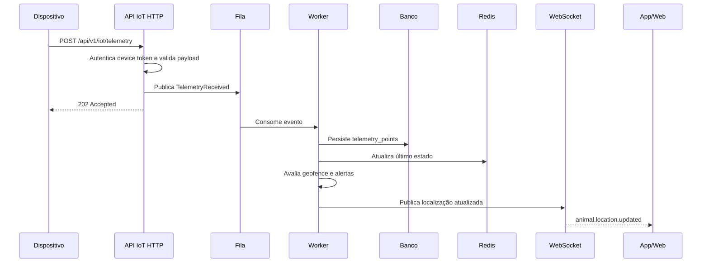
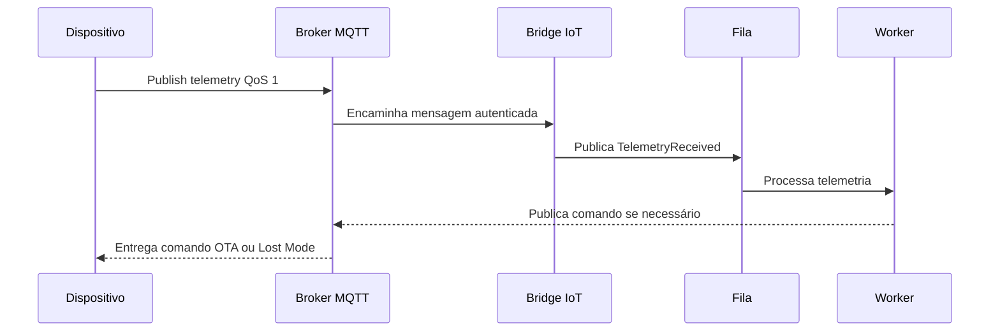

# Fluxos entre dispositivo, servidor e aplicativos

## Ingestão HTTP

## Ingestão MQTT

- Tópico de telemetria: `devices/{deviceSerial}/telemetry`.
- Tópico de status: `devices/{deviceSerial}/status`.
- Tópico de comandos: `devices/{deviceSerial}/commands`.
- Tópico de ack: `devices/{deviceSerial}/acks`.

## Rastreamento em tempo real

1. App autentica com JWT.
2. App abre WebSocket.
3. Backend autoriza inscrição no canal `private-pet.{petId}`.
4. Ao chegar nova telemetria, o worker publica o evento no canal.
5. App move o marcador no mapa com interpolação visual para suavidade.

## Geofence

1. Usuário desenha círculo, retângulo ou polígono no mapa.
2. Backend valida permissões e salva geometria.
3. Cada ponto recebido é comparado com geofences ativas do animal.
4. O sistema mantém em Redis o último estado dentro/fora por geofence.
5. Transições geram `geofence_events`, `alerts` e notificações.

## Modo perdido

1. Tutor ativa modo perdido no app.
2. API cria comando `lost_mode_on` para o dispositivo.
3. Worker envia comando por MQTT ou mantém pendente para polling HTTP.
4. Dispositivo reduz intervalo de envio e prioriza precisão.
5. App recebe atualizações mais frequentes e notificações constantes.
6. Ao desativar, API envia `lost_mode_off` e restaura intervalo normal.

## Notificações

- Push imediato para alertas críticos.
- E-mail para relatórios, lembretes e alertas configuráveis.
- SMS e WhatsApp planejados por adaptadores futuros.
- Preferências por usuário, pet, severidade e canal.

## Fluxo veterinário

1. Tutor concede acesso ao veterinário ou clínica.
2. Veterinário acessa painel com escopo limitado.
3. Visualiza atividade, peso, vacinas, consultas e medicamentos.
4. Registros clínicos geram auditoria.
